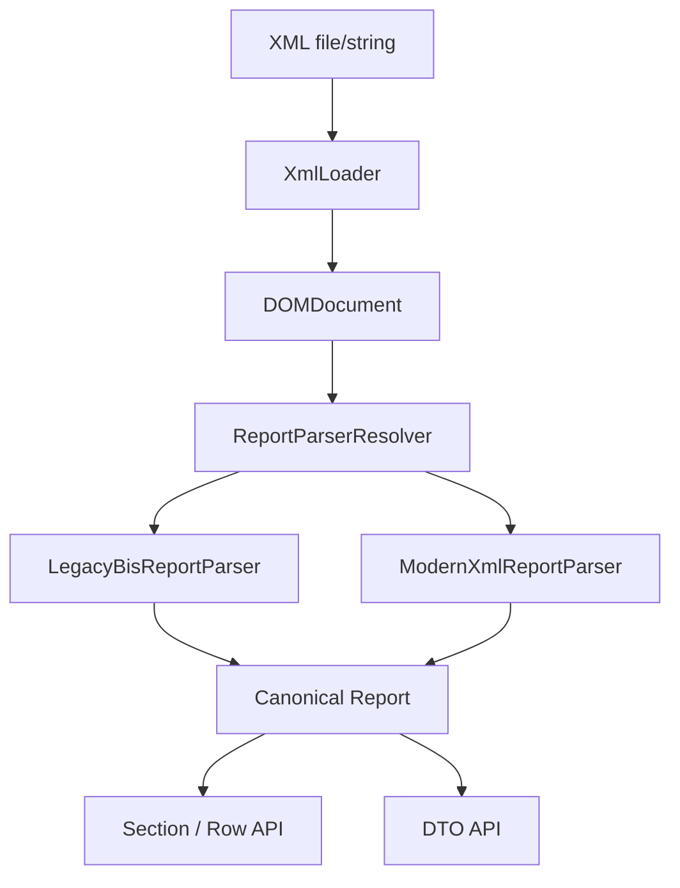
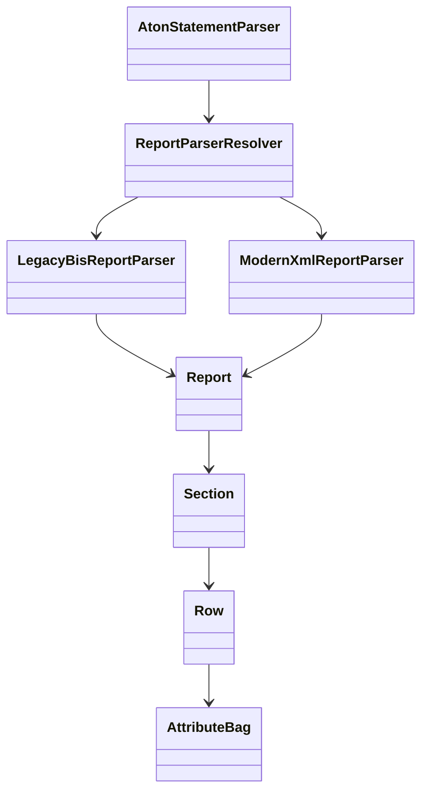

# Library Guide

Подробная карта библиотеки `aton-statement-parser`.

Документ нужен для двух задач:

- быстро понять, где находится нужный блок;
- не тратить время на чтение всего проекта подряд, если интересует конкретный слой.

## Навигация

1. Точка входа
2. Поток данных
3. Слои проекта
4. Канонические секции отчёта
5. DTO API
6. Исключения
7. Расширение библиотеки
8. Проверки качества

## Точка входа

Основная точка входа:

- `MasyaSmv\AtonStatementParser\AtonStatementParser`

Доступные методы:

- `fromFile(string $path): ReportInterface`
- `fromString(string $xml): ReportInterface`
- `version(): string`

## Поток данных



## Слои проекта

### 1. XML слой

Файлы:

- `src/Xml/XmlLoader.php`
- `src/Xml/XPathFactory.php`

Ответственность:

- чтение XML из файла и строки;
- нормализация кодировки;
- загрузка `DOMDocument`;
- подготовка `DOMXPath` для legacy BIS.

### 2. Parsing слой

Файлы:

- `src/Parsing/ReportParserResolver.php`
- `src/Parsing/LegacyBisReportParser.php`
- `src/Parsing/ModernXmlReportParser.php`
- `src/Parsing/ModernFieldCanonicalizer.php`
- `src/Parsing/SectionNameResolver.php`

Ответственность:

- определить формат отчёта;
- разобрать legacy и modern XML отдельно;
- свести секции и поля к одной канонической модели.

### 3. Доменная модель отчёта

Файлы:

- `src/Report/Report.php`
- `src/Report/Section.php`
- `src/Report/Row.php`
- `src/Report/AttributeBag.php`

Ответственность:

- представлять отчёт в общей структуре;
- давать универсальный доступ к секциям и строкам;
- хранить immutable-атрибуты и typed getters.

### 4. DTO слой

Файлы:

- `src/Dto/*`
- `src/Mappers/*`
- `src/Collections/*`
- `src/Contracts/Mappers/*`

Ответственность:

- давать более удобный API поверх канонических `Row`;
- возвращать immutable DTO и typed collections;
- отделять универсальный `Row` от частых пользовательских сценариев.

## Канонические секции отчёта

Ниже секции, которые библиотека сейчас считает основными.

### Общие данные

- `CommonData`

### Операции

- `Trades`
- `TradesRegRepo`
- `TradesNonRegRepo`
- `MoneyInOut`
- `MoneyInOut_io`
- `ClientMoneyConvert`
- `MoneyConvert`
- `StockInOut`
- `StockPayingOff`
- `CorpActionIn`
- `CorpActionOut`

### Состояние на дату

- `MoneyOnDate`
- `StockOnDate`
- `StockOnDate_Exg`
- `StockOnDate_NonExg`
- `StockOnDate_MTL`

## DTO API

Методы доступны из `ReportInterface`.

### Универсальный API

- `hasSection(string $name): bool`
- `section(string $name): Section`
- `operIds(): OperIdCollection`
- `findOperId(string $operId): ?Row`

### DTO API

- `commonData(): ?CommonData`
- `trades(): TradeCollection`
- `moneyInOut(): MoneyOperationCollection`
- `moneyOnDate(): MoneyBalanceCollection`
- `stockOnDate(): StockBalanceCollection`
- `moneyConvert(): MoneyConvertCollection`
- `stockInOut(): StockTransferCollection`
- `stockPayingOff(): StockPayingOffCollection`
- `corporateActionsIn(): CorporateActionCollection`
- `corporateActionsOut(): CorporateActionCollection`

## Ключевые связи



## Исключения

Текущие исключения библиотеки:

- `InvalidXmlException`
  - файл не найден;
  - XML пустой;
  - XML синтаксически некорректен.
- `ParseException`
  - базовое исключение парсинга.
- `UnsupportedReportFormatException`
  - XML не похож ни на legacy BIS, ни на modern root/source.
- `MissingBisNamespaceException`
  - legacy XML без корректного BIS namespace.
- `MissingSectionException`
  - пользователь запросил несуществующую секцию.
- `DtoMappingException`
  - отсутствует обязательное поле для DTO-маппинга.

## Расширение библиотеки

Если нужно добавить новую секцию или новый тип DTO, ориентир такой:

1. определить, как секция выглядит в old и new формате;
2. добавить каноническое имя секции в `SectionNameResolver`;
3. при необходимости добавить old-compatible поля в `ModernFieldCanonicalizer`;
4. проверить, достаточно ли базового `Row` API;
5. если секция часто нужна пользователю, добавить DTO, mapper, collection и метод в `Report`.

## Где искать нужное

Если нужен конкретный блок, ориентируйтесь так:

- проблемы чтения XML: `src/Xml`
- выбор формата: `src/Parsing/ReportParserResolver.php`
- legacy BIS: `src/Parsing/LegacyBisReportParser.php`
- modern XML: `src/Parsing/ModernXmlReportParser.php`
- канонизация секций: `src/Parsing/SectionNameResolver.php`
- канонизация полей: `src/Parsing/ModernFieldCanonicalizer.php`
- общий API отчёта: `src/Report`
- DTO: `src/Dto`, `src/Mappers`, `src/Collections`
- контракты DTO-мапперов: `src/Contracts/Mappers`
- исключения: `src/Exceptions`
- тесты happy path: `tests/*Parse*`, `tests/DtoMappingTest.php`
- тесты negative path: `tests/NegativeParseTest.php`
- тесты immutable/guards: `tests/ImmutableCollectionsTest.php`

## Проверки качества

Перед PR должны быть зелёными:

- `composer cs:check`
- `composer stan`
- `composer psalm`
- `composer test`

## Релизы

Релизы идут по тегам формата:

```bash
vX.Y.Z
```

GitHub Release создаётся автоматически workflow-файлом:

- `.github/workflows/release.yml`
